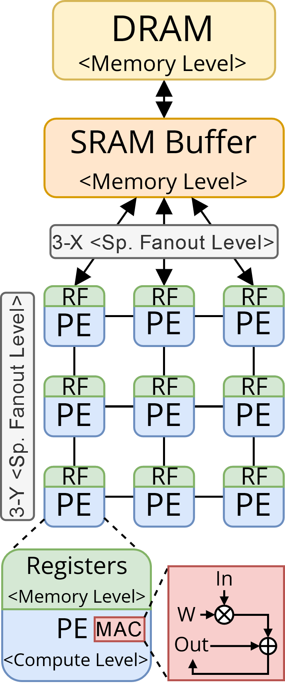
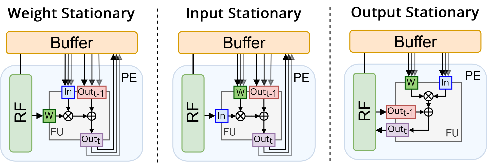
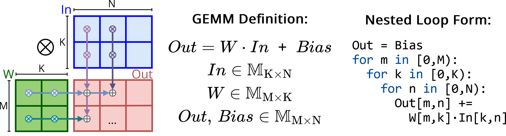
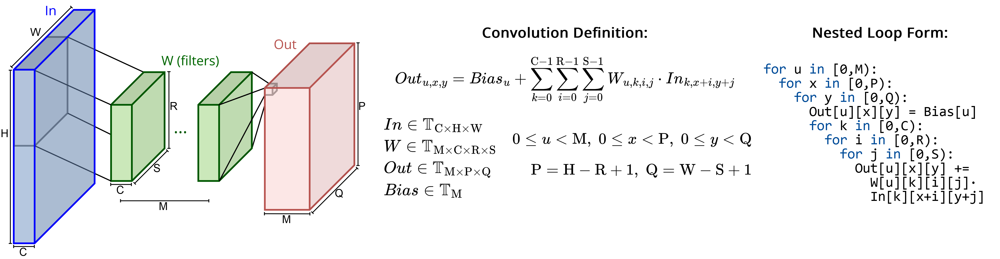
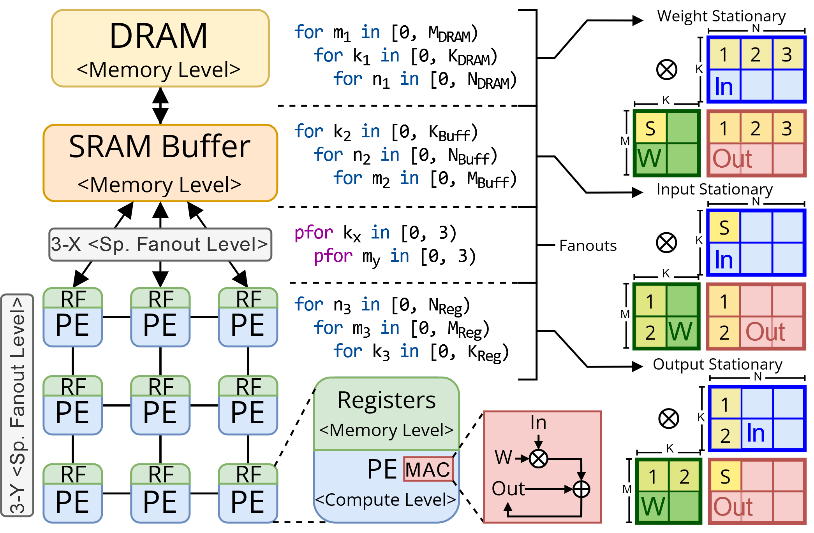
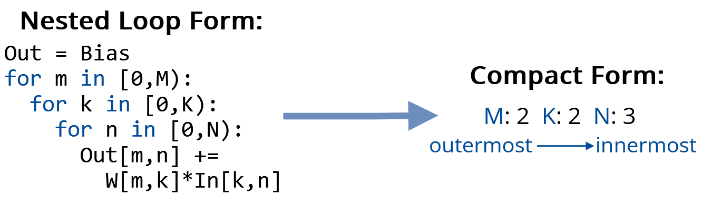
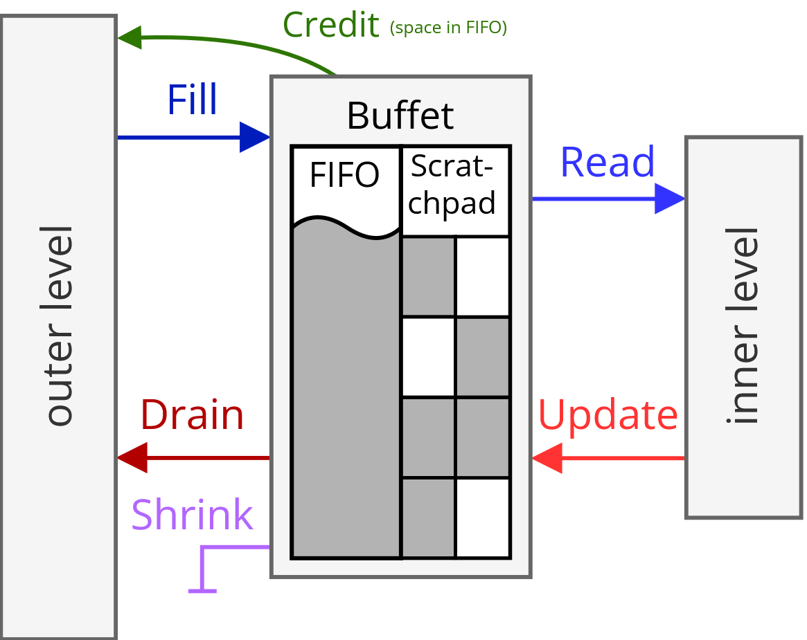

# FactorFlow

A promising design in the domain of modern deep learning hardware accelerators is **Spatial Architectures (SAs)**, which employ a multidimensional array of **Processing Elements (PEs)** that execute Multiply and Accumulate (MAC) operations paired with a dedicated **memory hierarchy** to enable data reuse.
Spatial architectures aim to reduce the energy and latency required for running kernels like **General Matrix Multiplications (GEMMs)** and convolutions, and are very flexible in how they can handle them. They can pick between many ways to exploit parallelism, to allocate and move data between memories while reusing a specific part of it, and to distrubute MAC operations among PEs. As such, to exploit the full capabilities of a SA it is crucial to decide the best **mapping** with which a computation is ran by the hardware. However, finding such an optimal mapping is a complex taks due to the size of the map-space (the space of all possible mappings for a kernel-SA pair), thus requiring specialized approaches.

This repository presents **FactorFlow (FF)**, a framework for mapping GEMMs (now extended to convolutions as well) on SAs, comprising an analytical model and a mapper. The analytical model within FF uses a description of a SA and a mapping to quickly estimate the performance of the two. FF's mapper employs instead three steps to search the map-space for optimal mappings, while using the analytical model to gather feedback throughout its exploration.

## Authors

- **Marco Ronzani** ([marco.ronzani@polimi.it](mailto:marco.ronzani@polimi.it)), PhD Student, DEIB, Politecnico di Milano
- **Cristina Silvano** ([cristina.silvano@polimi.it](mailto:cristina.silvano@polimi.it)), Full Professor, DEIB, Politecnico di Milano

## Publications

Marco Ronzani and Cristina Silvano. 2025. **FactorFlow: Mapping GEMMs on Spatial Architectures through Adaptive Programming and Greedy Optimization.** In 30th Asia and South Pacific Design Automation Conference (ASPDAC ’25), January 20–23, 2025, Tokyo, Japan. ACM, New York, NY, USA, 7 pages. https://doi.org/10.1145/3658617.3697670

# Guide

## Setup

Requires [**Python 3.13 (with free-threading)**](https://docs.python.org/3/whatsnew/3.13.html#whatsnew313-free-threaded-cpython) or newer.

To setup FactorFlow run:
```bash
# clone this repository
git clone https://github.com/EMJzero/FactorFlow.git
cd FactorFlow
# install python dependencies
pip install -r requirements.txt
# test that everything works
python test.py
python main.py
```
> **Important**: to take advantage of free-threading in Python 3.13, replace `python` with `python3.13t` in any of the shown commands. The resulting removal of the global interpreter lock will allow threads to truly run concurrenlty.

Optionally install Accelergy through the instructions for the [Timeloop Infrastructure (native install)](https://timeloop.csail.mit.edu/v4/installation). Install solely Accelergy, there is no need for Timeloop.<br>
This isn't required to used FactorFlow as long as you provide the component-level energy estimates yourself or use the provided examples in [`architectures.py`](architectures/architectures.py) or [`solutions_db.py`](architectures/solutions_db.py). Installing Accelergy is instead mandatory whenever you intend for it to provide component level energy estimates (that is, whenever importing [`accelergy_hw_data.py`](architectures/accelergy_hw_data.py), like shown in [`architectures_hw_data.py`](architectures/architectures_hw_data.py)).<br>
If you installed Accelergy, but not as a Python package, you should change `ACCELERGY_PATH` in [`settings.py`](settings.py) to point to Accelergy's parent directory.<br>
To verify that Accelergy works correctly, run: `python -m architectures.accelergy_hw_data`.

## Usage

There are two ways to use FactorFlow:

- Run [`main_cli.py`](main_cli.py) and follow its help menu for more information. This is intended for normal usage, it allows you to pick the architecture specification and the target computation through the CLI. You may also provide your own python file with a custom architecture as shown in [`example_arch.py`](architectures/example_arch.py). Some example commands:
  - `python main_cli.py -h`: prints the help menu;
  - `python main_cli.py eyeriss KQV`: run FF with the existing Eyeriss model for the KQV GEMM;
  - `python main_cli.py simba 128 768 512`: run FF with the existing Simba model and for a GEMM with $\mathrm{M}:128,\: \mathrm{K}:768,\: \mathrm{N}:512$.
  - `python main_cli.py eyeriss-conv 128 768 512 128 768 512`: run FF with the existing Eyeriss model and for a convoluion with $\mathrm{M}:128,\: \mathrm{P}:768,\: \mathrm{Q}:512$, $\mathrm{C}:128,\: \mathrm{R}:768,\: \mathrm{S}:512$.
  - `python main_cli.py simba-conv 128 768 512 128 768 512 2 2 1 1`: run FF with the existing Simba model and for a convoluion with $\mathrm{M}:128,\: \mathrm{P}:768,\: \mathrm{Q}:512$, $\mathrm{C}:128,\: \mathrm{R}:768,\: \mathrm{S}:512, \mathrm{Pstride}:2, \mathrm{Qstride}:2, \mathrm{Rdilation}:1, \mathrm{Sdilation}:1$.
  - `python main_cli.py architectures/example_arch.py architectures/example_comp.py`: run FF with the architecture provided in `example_arch.py` and for the computation and coupling in `example_comp.py`.

- Customize and run [`main.py`](main.py). This is the best option to experiment with and modify FF, with `main.py` being a minimal script which runs FF on the hardcoded architecture and computation. You may import in such script any of the files in this repository to explore its functionalities.

Additional scripts:

- [`explore_random_mappings.py`](comparisons/explore_random_mappings.py) enables the gathering of data for random mappings on a given architecture. Run with `python -m comparisons.explore_random_mappings`, use `-h` for usage instructions.

- [`explore_starting_points.py`](comparisons/explore_starting_points.py) enables the gathering of data for FactorFlow optimization results when starting from a random mapping during local search on a given architecture. Run with `python -m comparisons.explore_starting_points`, use `-h` for usage instructions.

At last, consider updating [`settings.py`](settings.py) to accomodate your needs, every setting is thereby documented.

## Spatial Architectures Modeling



Spatial architectures in FactorFlow are modeled as a hierarchy of levels. Level types, implemented in [`levels.py`](levels.py) are:
- **Memory Level (`MemLevel`)**: represents a storage component holding part of a GEMM's three operands, described by its capacity, access energy, bandwidth, and which operand(s) it stores. We say that a level "bypasses" an operand whenever it does not store it, delegating it to other levels. The outermost level of any SA must be a memory where operands are loaded before the computation, usually representing DRAM or permanent storage.

- **Spatial Fanout Level (`FanoutLevel`)**: models the spatial replication of all subsequent components in a multidimensional array of instances. Its key characteristics are the number of instances available and any spatial multicast/reduction capabilities.

- **Compute Level (`ComputeLevel`)**, represents a functional unit capable of performing MAC operations, defined by the energy and the number of clock cycles required for a MAC. More than one MAC operation can be modeled to run in the specified cycles. This level must occur only once and be the innermost one.

<!--<p align="center"></p>-->
<!---->


All levels (memory ones in particular) significantly change their behaviour depending on the **dataflow** they employ. A dataflow specifies how data moves in between two levels during each iteration of the computation, in particular determining which operands are loaded (read) from outer memories, which are offloaded (written/updated) to outer memories, and which may remain on inner memories. Dataflows are essential in determining how data reuse is exploited on SAs. <br>
For each level of the memory hierarchy, we classify its dataflow according to which values are kept stationary and thus accessed more than once, or which sets of partial results are to be ready together for a single reduction:

- **Weight stationary**: each weight, or set of weights, remains stationary on a memory while multiple input and output values pass by to complete multiple MACs involving the same weight(s). Weights thus leverage temporal and/or spatial multicast.

- **Input stationary**: each input, or set of inputs, remains stationary on a memory while multiple weights and output values pass by to complete multiple MACs involving the same input(s). Inputs thus leverage temporal and/or spatial multicast. Intuitively, an input stationary dataflow can always be obtained starting from a weight stationary one by swapping the inputs and weights and adequately reformulating the workload.

- **Output stationary**: multiple MAC operations updating the same output value, or set of values, are performed while keeping partial results on the same memory. Outputs thus leverage temporal and/or spatial reduction.

## Mapping Representation

### Workload




Our workload is a kernel in the form of three tensors (operands) indicized via several nested loops around a MAC operation: $Out = W \cdot In + Bias$. The order of loops is arbitrary and data reuse opportunities arise from all three operands being orthogonal to different loops and remaining constant throughout them. Moreover, some indices may operate along the same dimension of some tensor, also introducing halo (sliding window) reuse opportunities. The $Bias$ term can be handled outside the loops nest, by initializing $Out$ with it and carrying out the sum through the first round of accumulation. Hence, we consider as operands solely the input $In$, the weights $W$, and the output $Out$.

In FactorFlow a kernel is defined by a coupling, which specifies existing dimension and their relation with tensors, and a computation, which gives sizes to said dimensions. The GEMM and convolution kernels are already available, but any kernel of the above form can be specified via custom couplings and shapes.

### Mapping Decisions



Let's introduce the three main decisions involved in a mapping:

- **Tiling**: to fit a kernel's tensors on the limited hardware resources of a SA, we repeatedly tile it into progressively smaller kernels throughout the SA's memory hierarchy.
Tile sizes are chosen to both fit in and exploit to the maximum the storage available at their level.
This is represented by replicating the kernel's loops nest across all memory levels of the SA, with each copy performing a subset of the total iterations along every dimension.
Loops on a memory level unfold over time, and each memory in the hierarchy only needs to store all the values used in iterations on its loops or inner ones, enabling their reuse across all such iterations.

- **Parallelism Strategy**: spatial fanout levels allow some iterations to unfold spatially across multiple instances of subsequent levels, each running the same inner loops concurrently on partially different data.
Hardware limitations on resources and flexibility constrain the maximum number of such spatial iterations and also which dimensions can exploit them.
Thus, a mapping must specify which dimension(s) leverage parallelism and allocate their spatial iterations.
This is modeled like tiling, by having a copy of one or more of a loop dedicated to each spatial fanout level.

- **Loop Ordering**: any level's group of loops within a tiled kernel can be arbitrarily reordered without affecting the correctness of the computation, but with relevant implications on data movements and reuse within the SA.
This is what determines the **dataflow**, a specific order of a loops and the data access patterns derived from it. Each dataflow reuses the operand orthogonal to the dimension of the innermost iterations it performs, ignoring loops with a single iteration. Orthogonality leads to complete stationarity of the operand (e.g. iterating $\mathrm{N}$ first for a GEMM yields weights stationarity), but another form of reuse also occurs when the innermost iteration goes over a dimension coupled to a sum of indices (e.g. the input's width or height of a convolution), creating a sliding window effect over the involved operand, and reusing part of its previous tile at ever subsequent iteration.

### Notation

Throughout FactorFlow, the following compact notation for triplets of nested loops on a level is used, omitting dimension with a single iteration:

<p align="center">
  
</p>

Data regarding memory operations (MOPs) is always reported as comulative across instances (e.g. 4 reads from each register file of two PEs are reported as 8 reads on that register file).

Data for bandwidths is always in $words/clock\textrm{-}cycle$, and is divided between read, write, fill, and drain bandwidth, following the notation used for Buffets:

<p align="center">
  
</p>